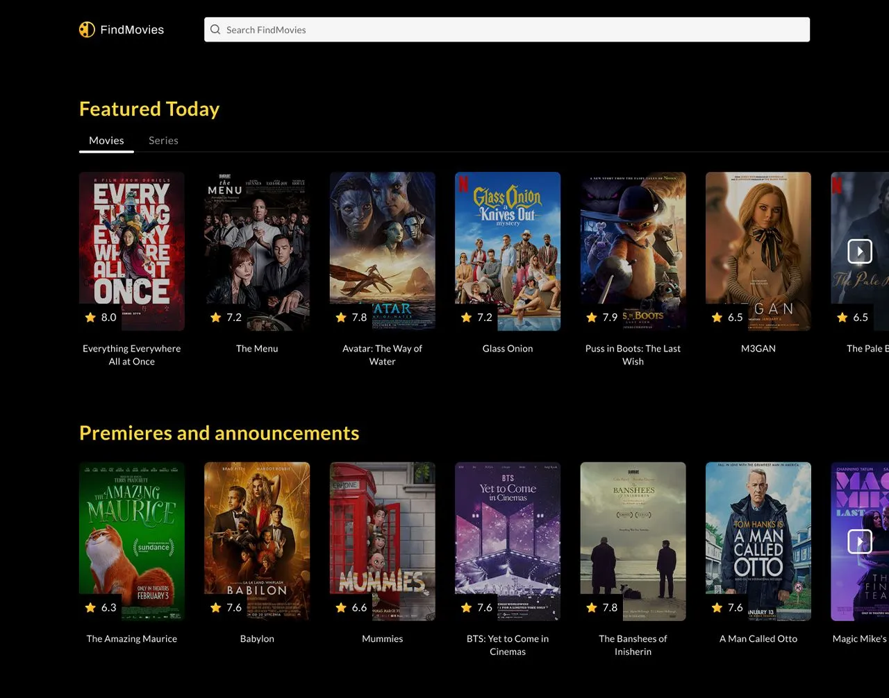

# Find Movies - In progress 🎥🍿



## Table of Contents

- [Project Brief](#project-brief)
- [Technical Details](#technical-details)
- [Setup](#setup)

## Project Brief

🔍 **Find Movies** is an application that bridges the gap between cinematic wonders and avid viewers. Delivering a seamless exploration experience to users, it allows them to discover, search, and delve deep into the intriguing realms of movies and TV series.

## Technical details

🔧 **API**: [OMDB](https://www.omdbapi.com/) API is used to fetch Movies and TV series.

💅 **Styling**: [Tailwind CSS](https://tailwindcss.com/) is used for styling all the screens.

## Setup

🚀 **Clone the repo** by running the following command:

```sh
git clone https://github.com/thejsdeveloper/find-movies.git
```

📂 **Go to the project directory**:

```sh
cd find-movies
```

💻 **Install the dependencies**:

```sh
yarn install

# or

npm install
```

🏃 **Run the project locally**:

```sh
yarn dev

# or

npm run dev
```

🌐 **Go to the browser**:

Navigate to `http://localhost:3000` to see the app.

Feel free to contribute and follow the licensing guidelines! 😄📝
